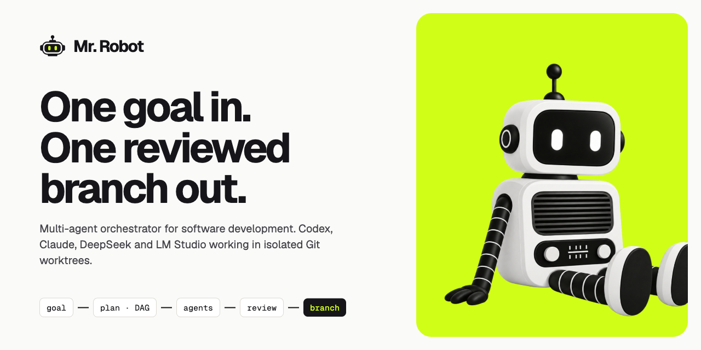

# MrRobot — multi-agent orchestrator

[Español](README.es.md) · **English**



A multi-agent engine in TypeScript that takes a high-level goal, breaks it down
into a DAG of tasks, runs them with Codex / Claude / DeepSeek / LM Studio in
isolated Git worktrees, reviews the result, and leaves the work on an isolated
Git branch.

> **You don't need to buy tokens or a separate paid API.** Codex and Claude use
> your **regular ChatGPT / Claude subscription** (Plus, Pro, etc.). And if a
> provider runs out of quota or hits its limit, the engine **automatically moves
> on to the next configured model** (fallback chain).

## Prerequisites

Basics:

- **Node.js 22.8+** and **npm** (the test suite uses `--test-isolation=none`)
- **git**

To run real tasks (not in mock mode), the engine invokes the `codex` and
`claude` CLIs directly, so they must be installed, available in your `PATH`, and
authenticated once:

- **Codex CLI** — `codex` provider (complex coding tasks):
  ```bash
  npm install -g @openai/codex
  codex login
  ```
- **Claude Code CLI** — `claude` provider (planner, reviewer, supervisor and
  tasks):
  ```bash
  npm install -g @anthropic-ai/claude-code
  claude          # the first run opens the authentication flow
  ```
- **DeepSeek** — `deepseek` provider over HTTP; needs no CLI, only the
  `DEEPSEEK_API_KEY` variable (see [Configure the keys](#configure-the-keys-real-use-only)).
- **LM Studio** — `lmstudio` provider over HTTP, against a model running on
  your machine; needs no CLI or key, only [LM Studio](https://lmstudio.ai) open
  with its local server enabled (`http://localhost:1234/v1` by default —
  configurable with `LMSTUDIO_BASE_URL`, see [Configure the keys](#configure-the-keys-real-use-only)).

> **Note:** you don't need to buy tokens or a separate paid API. Codex and
> Claude authenticate with your **regular ChatGPT / Claude subscription** (Plus,
> Pro, etc.) and use that quota. LM Studio runs locally and doesn't consume paid
> tokens either. The only provider that needs a paid API key is DeepSeek.
>
> When a provider runs out of quota or hits its limit (rate limit, session,
> etc.), the engine **automatically moves on to the next configured model** in
> the fallback chain (see [Fallback](#fallback)), so it never gets stuck. If
> **all** providers in the chain are limited, it waits and retries the chain
> automatically (honoring the provider's `retry after`).

If you just want to try the app without spending tokens, use **mock mode**
(step 3) and you don't need to install or authenticate any of these.

## Quick start

### 1. Install dependencies

```bash
npm install        # backend
cd ui && npm install && cd ..   # graphical interface
```

### 2. Start the app

Open **two terminals** from the repo root:

```bash
# Terminal 1 — backend (API at http://127.0.0.1:4000, reloads on code changes)
npm run dev

# Terminal 2 — interface (http://localhost:3000)
cd ui && npm run dev
```

Then open **http://localhost:3000** in your browser.

The first time, the **setup wizard** opens (`/onboarding`): it checks which
agents you have, installs the Codex/Claude CLIs, validates and saves the
DeepSeek key, the LM Studio URL and the `GITHUB_TOKEN`, and picks the default
agents. Keys are saved in `.env` and the global config in
`.mrrobot/config.json`, so they survive a backend restart. The wizard shows up
again if no connected agent that writes code is left, and can be reopened from
*Settings → Setup wizard*.

### 3. (Optional) Try it without spending tokens

If you don't want to use real models or touch Git, start the backend in mock
mode:

```bash
MRROBOT_MOCK=1 npm run dev   # Terminal 1
cd ui && npm run dev         # Terminal 2
```

### Configure the keys (real use only)

Create a `.env` file in the root with your keys:

```env
DEEPSEEK_API_KEY=your_key
LMSTUDIO_BASE_URL=http://localhost:1234/v1   # optional, only if you don't use the default port
GITHUB_TOKEN=your_token      # optional, for GitHub repos
```

Without `MRROBOT_MOCK=1` you need `DEEPSEEK_API_KEY` and the `codex`/`claude`
CLIs installed and authenticated (see [Prerequisites](#prerequisites)) for all
agents to work. `LM Studio` only needs the local server open with a model
loaded. See the [Environment variables](#environment-variables) section for more
options.

## Architecture

```text
UI (ui/ — Next.js App Router)
 ↓  HTTP + SSE
API (src/api — thin HTTP layer)
 ↓
Project service (src/projects)
 ↓
LangGraph (src/graph)         planner → run → supervise → finalize
 ↓
Planner / Scheduler / Supervisor (src/planner, src/scheduler, src/supervisor)
 ↓
Tasks (src/tasks)             runTask: retries + fallbacks + worktrees
 ↓
Agent Router (src/agents)     selectAgent + getFallbackChain + runAgent
 ↓
Codex / Claude / DeepSeek (src/providers)
 ↓
Git worktrees (src/workspace)
 ↓
Storage (src/storage)         PGlite (Postgres) or in-memory
```

The UI never calls Codex/Claude/DeepSeek, Git, worktrees or PostgreSQL directly.
All interaction goes through the HTTP API (`src/api`), which delegates to the
existing services. Wire types are shared in `shared/types.ts`.

- `providers/`: run the CLIs/APIs. `runCodex`, `runClaude`, `runDeepSeek`.
- `agents/`: `selectAgent` (selector by type/complexity), `getFallbackChain`
  (fallback chain), `isRetryableError`, `classifyAvailability`, `runAgent`.
- `tasks/`: `runTask` runs a task with per-agent retries and fallback between
  agents, each attempt in a clean worktree, and commits the result.
- `scheduler/`: validates the DAG (IDs, dependencies, cycles) and runs tasks in
  parallel with a concurrency limit, respecting dependencies. Dispatch is
  continuous: as soon as a task finishes, dependencies are recomputed and its
  slot is taken by the next ready task.
- `workspace/`: worktrees, commits, dependency cherry-picks and the final branch.
- `planner/`, `reviewer/`, `supervisor/`: LLM agents with Zod-validated output.
- `projects/`: Project entity and orchestration (create/run/pause/resume).
- `chats/`: conversation threads per project; each message goes through the
  planner and adds/adjusts tasks associated with the chat.
- `storage/`: persistence (PGlite) + event log.
- `graph/`: LangGraph graph that orchestrates planner/scheduler/supervisor.

## Useful commands

```bash
npm test              # engine tests
npm run typecheck     # backend type check
npm run mrrobot help  # CLI help
```

The UI talks to the API through `NEXT_PUBLIC_API_URL` (defaults to
`http://127.0.0.1:4000`).

Mock mode deterministically simulates agents, planner, reviewer, supervisor and
worktrees. Scenarios available via `MRROBOT_MOCK_SCENARIO`: `success`
(default), `replan` and `fail`.

## Configuration

Centralized in `src/config/index.ts` (`loadConfig`):

```ts
{
  concurrency: 3,          // initial concurrency
  maxConcurrency: 6,       // ceiling of the adaptive concurrency
  maxRetriesPerAgent: 1,
  maxReviewFixCycles: 2,
  plannerMaxAttempts: 2,
  limitRetry: {             // chain retry when limits are exhausted
    maxLimitRetries: 3,
    baseDelayMs: 30000,
    maxDelayMs: 900000,     // if the provider announces a later replenishment, it doesn't wait
  },
  checks: { commands: [] }, // [] => auto-detect npm scripts
  defaultAllowedAgents: [], // [] => no restriction; the user picks them in the chat
}
```

Concurrency is **adaptive**: it starts at `concurrency`, goes up one at a time
up to `maxConcurrency` with each task that finishes successfully, and is halved
when a task exhausts its agents due to availability (quota, rate limit, auth or
missing CLI).

The scheduler **doesn't work in batches**: it doesn't wait for in-flight tasks
to finish before launching the next one. Each slot is filled as soon as it frees
up, and a task whose dependencies have just completed starts immediately. With
batches, one slow task kept the other slots idle until it finished.

There are no fixed agents per role: the user chooses the set of allowed agents
when launching the chat's first prompt and, for each task and each orchestration
role (planner, reviewer, supervisor, grill and instructions), the engine selects
the agent by type and complexity and walks a fallback chain.

A project can override these values when created (*New Project* screen,
advanced) or later through `PATCH /api/projects/:id/config` (while it is in
`draft`, `ready` or `paused`). On the first change, the project materializes its
own config (it stops inheriting from the global one). If it defines no config,
it uses the global one.

## Environment variables

```env
DEEPSEEK_API_KEY=...       # required by the DeepSeek provider
LMSTUDIO_BASE_URL=http://localhost:1234/v1   # optional, URL of the LM Studio local server
GITHUB_TOKEN=...           # optional, to validate/push to GitHub repos (HTTPS)
MRROBOT_DATA_DIR=.mrrobot/data   # optional, PGlite data directory
MRROBOT_PORT=4000          # API port
MRROBOT_HOST=127.0.0.1     # API host
MRROBOT_REPO=...           # optional, Git repository directory
MRROBOT_MOCK=1             # mock mode (simulated agents and git)
MRROBOT_MOCK_SCENARIO=success|replan|fail
MRROBOT_MOCK_DELAY_MS=0    # artificial delay per agent run
MRROBOT_LOG_DIR=.mrrobot/logs   # optional, directory for the monitoring .log files
MRROBOT_CLAUDE_PERMISSION_MODE=acceptEdits   # Claude CLI permissions when running tasks
MRROBOT_ENV_FILE=.env      # optional, file where the UI saves the keys
MRROBOT_SETTINGS_FILE=.mrrobot/config.json   # optional, global config and initial wizard state
```

`MRROBOT_CLAUDE_PERMISSION_MODE` (`default`, `acceptEdits`, `bypassPermissions`
or `plan`) controls the `--permission-mode` that `claude -p` is launched with
for coding tasks. It defaults to `acceptEdits`: the agent writes to its worktree
without asking and can run `npm`, `npx`, `pnpm`, `yarn`, `node` and `tsc`
(`--allowedTools`; override with `MRROBOT_CLAUDE_ALLOWED_TOOLS`, a
comma-separated list). Any other command is denied. Raise it to
`bypassPermissions` if tasks need more.
With `default`, in non-interactive mode every edit is denied and tasks fail with
"did not create or modify any file".

## PostgreSQL

Persistence uses **PGlite** (Postgres embedded in WASM) through a generic
`SqlExecutor`, so the same SQL works on top of `pg`. The schema
(`src/storage/sql.ts`) defines: `projects`, `tasks`, `task_dependencies`,
`task_attempts`, `agent_runs`, `reviews`, `supervisor_runs`, `events`, `chats`,
`chat_messages`.

For real Postgres, just add a `SqlExecutor` with `pg` and use `SqlStorage`.

## CLI commands

```bash
npm run mrrobot -- create "Create a TypeScript library with sum(a,b), tests and README"
npm run mrrobot -- create "Web calculator" --folder ~/projects/calc --remote https://github.com/acme/calc.git
npm run mrrobot -- plan <project-id>
npm run mrrobot -- run <project-id>
npm run mrrobot -- status <project-id>
npm run mrrobot -- tasks <project-id>
npm run mrrobot -- pause <project-id>
npm run mrrobot -- resume <project-id>
npm run mrrobot -- delete <project-id>
```

## Project folder and remote

Each project can have its own folder and a GitHub remote:

- **Folder**: chosen in the UI with the `Browse…` button (native macOS dialog via
  `osascript`) or with `--folder` in the CLI. If it doesn't exist, it is created
  and initialized with `git init` + an initial commit; if it is already a git
  repo, it is reused. If left empty, the current repository is used
  (`MRROBOT_REPO` or the backend's cwd).
- **Remote**: the optional URL is configured as `origin` of the project's repo.
  If you define `GITHUB_TOKEN`, access is validated with `git ls-remote` when
  the project is created, and the final branch (`agent/project-<id>-final`) is
  pushed to the remote on completion. Without a token, nothing is pushed.

Each project's worktrees are created under `<folder>/.worktrees/`, which is
added to the repo's `.git/info/exclude` so it doesn't dirty the working tree.

Deleting a project (`DELETE /api/projects/:id`, `mrrobot delete` or the UI's
*Delete* button) removes it from the app along with its tasks, events and
reviews. It does not delete its folder or the worktrees on disk.

## Project states

`draft → planning → ready → running → paused | blocked | completed | failed | cancelled`

## Task states

`todo → blocked → ready → running → interrupted | done | failed`

- `blocked`: depends on incomplete tasks or there is an integration conflict.
- `interrupted`: was left `running` after a crash; it recovers to `ready`.

## Fallback

`getFallbackChain(task)` returns an ordered list of candidates according to
`type`/`complexity`, restricted to the chat's allowed agents. If an agent fails
with a transient error, it is retried; if the error is not retryable or the
provider is unavailable, it moves on to the next one. An explicit agent
(`task.agent`) goes first. Each agent attempt starts from a clean worktree.

`classifyAvailability` detects quota limits (`usage_limit`), rate limits
(`rate_limit`), authentication limits (`auth`) and missing CLI (`cli_missing`)
and treats them as "unavailable", so when a provider's quota or limit runs out
the engine jumps to the next model in the chain with no manual intervention. If
**all** candidates fall due to limits, `runTask`/`runRoleAgent` wait (honoring
the provider's `retry after` or an exponential backoff) and walk the chain again
up to `limitRetry.maxLimitRetries` (3 by default). This mechanism is shared by
tasks and orchestration roles (`runRoleAgent` in `src/agents/role.ts`).

When an agent falls due to a limit and another candidate completes the task,
`AgentHealth` (`src/agents/health.ts`) puts it in **quarantine**: in subsequent
tasks and roles that agent goes to the end of the chain until it is replenished,
so the engine doesn't start again with the one that failed and carries on with
the one that worked. Quarantine lasts the provider's `retry after` or, if it
doesn't specify one, 5 minutes (configurable with `AgentHealthOptions`), capped
at 1 hour. On the server the memory is a single instance and survives across
rounds and projects; without `agentHealth`, the order from `getFallbackChain`
doesn't change.

## Agentic Harness (DeepSeek / LM Studio with Tool-Calling)

DeepSeek and LM Studio can operate in two modes:

### 1. Text mode (default)
- A single API call
- Returns text (summary/analysis)
- No access to disk or commands
- Fast and cheap

### 2. Agentic mode (tool-calling + sandbox)
Available in `coding` tasks when a harness configuration is present:
- **Tool-calling loop**: the provider calls tools (`read_file`, `write_file`, `run_command`, etc.) and receives results, iterating until done
- **Local sandbox**: operations are confined to the worktree (`cwd`), with:
  - **Path containment**: rejects `../`, symlinks that escape, `.git`
  - **Command allowlist**: `npm`, `node`, `git` and shell utilities (`ls`, `cat`, `grep`, `find`, `sed`, `mkdir`, `cp`, `mv`…) + argv rules; for `git`, any subcommand is allowed except network and configuration operations (`push`, `fetch`, `pull`, `clone`, `remote add|set-url|remove|rename`, `config`, `credential`, `filter-branch`)
  - **Resource limits**: max 40 iterations, 100 tool calls, 300s timeout, 4 MiB total writes
  - **Filtered credentials**: `HOME` points to a temporary directory to prevent npm from reading `~/.npmrc` with tokens
- **Seeded dependencies**: the worktree receives `node_modules` from the dependency store before the agent starts (see *Dependency store*)
- **Automatic commit**: when finished, the changes are committed

The harness is **provider-agnostic**: any tool-calling-compatible API (OpenAI, DeepSeek, Claude) can use it. It is currently enabled for DeepSeek and LM Studio.

### Configuration

In `OrchestratorConfig` (project or global):

```ts
harness?: {
  enabled?: boolean;
  bounds?: {
    maxIterations?: number;     // default: 40
    maxToolCalls?: number;      // default: 100
    timeoutMs?: number;         // default: 300000 (5 min)
    maxInvalidToolCalls?: number; // default: 3
    maxNoToolReplies?: number;  // default: 2
    maxSandboxViolations?: number; // default: 5
  };
  sandbox?: {
    allowedCommands?: string[]; // default: ["npm", "node", "git"]
  };
}
```

`coding` tasks automatically use agentic mode if:
- `harness` is defined in the config
- DeepSeek or LM Studio is chosen by the fallback chain

### Errors

Harness errors (`[harness]` and `[sandbox]` prefixes) are **not retried** on
other agents; they are fatal for that task. This avoids useless timeout/sandbox
violation loops.

## Dependency store

Each attempt of each task runs in a freshly created worktree, which is born
without `node_modules` (it isn't committed). Installing from scratch there was,
by far, the slowest part of the cycle: the agent paid for it at startup and
again in the install check.

`src/checks/deps-store.ts` maintains a store of already-installed
`node_modules`, indexed by the lockfile's contents (or, without a lockfile, by
the `package.json` fields that determine what gets installed). The first
worktree that installs leaves its tree in the store; subsequent ones receive it
**before the agent starts** as a hard-link copy, just like pnpm does with its
store.

- Store: `~/.cache/mrrobot/deps` (configurable with `MRROBOT_DEPS_CACHE`).
- The `npm install` check **still runs**: "installs without errors" is a common
  acceptance criterion. With the tree already seeded and a lockfile present, npm
  only verifies it.
- Everything is best-effort: if the store fails or there is no entry, it
  installs as usual.

Measured on a Next.js project with a lockfile, the per-task dependency cost
drops from ~6.7 s to ~0.5 s (13x). In projects with a large `node_modules` the
difference is greater, because what is avoided is extracting thousands of files.

## Review

After a task completes, the local checks (`npm run typecheck|build|test`;
`build`→`test` in order and `typecheck` in parallel) run **in the agent's own
worktree before it is deleted**, reusing the `node_modules` it already has (see
*Dependency store*). Then an LLM reviewer validates against the
`acceptanceCriteria`. In `low` tasks with no criteria and green checks, the LLM
review is skipped (the checks are the gate). If any check fails, the reviewer
isn't called either: the task is rejected and the fix-cycle feedback carries the
tail of the check's output. If the reviewer itself doesn't respond with valid
JSON (after one retry) or no reviewer is available, the task fails without
consuming the worker's fix cycles.
If it rejects, the task is retried with the review feedback up to
`maxReviewFixCycles`; on each retry the agent **continues from its previous
result** (it doesn't redo the task) and the final tree is flattened into a
single commit on top of the base. After that it ends up `failed` if it still
isn't approved.

## Replanning

After each round, the supervisor decides `continue | replan | pause | fail`. With
`replan`, the planner receives the goal, the completed/failed tasks and the
reason, and returns a new validated DAG; `done` tasks are kept and the remaining
ones are retried.

## Chats per project

A project can have several **chats** (independent conversation threads). Each
chat stores its history (`chats` + `chat_messages` in storage) and the tasks it
generates. When a message is sent:

1. The user's message is persisted and `chat.message` is emitted.
2. The planner receives the project's goal, the chat's current plan and the
   conversation, and returns a plan.
3. Plan IDs are prefixed per chat (`C1-TASK-001`, `C2-TASK-001`, …) so they
   don't collide across chats, and tasks are associated with the chat
   (`task.chatId`).
4. The chat's `done` tasks are kept; the rest is replaced by the new plan. Tasks
   from other chats are untouched.
5. The assistant's message (summary + IDs) is saved and `chat.message` and
   `plan.updated` are emitted.

If the project was `draft` or in a terminal state (`completed`/`failed`/
`cancelled`) and the chat adds pending tasks, the project goes back to `ready`
so a new run can be launched. Deleting a chat removes its tasks and messages.

Chats are exposed in the UI as a **Chats** tab (available in all states except
`running`) and also in the **sidebar**: each recent project shows its chats
grouped, with a `+` button to create a new one. Clicking a chat in the sidebar
opens the project on the Chats tab with that chat selected
(`/projects/:id?chat=:chatId`). The backend is the source of truth and SSE
refreshes the thread live.

## Git

- Each attempt: branch `agent/<task>-attempt-N` and worktree `.worktrees/...`.
- Dependencies: `integration/<task>` with `git cherry-pick` of the dependencies'
  commits. If there is a conflict, the task is left `blocked` with
  `integrationError` (`type: "git_conflict"`), without touching the main repo.
- Final result: isolated branch `agent/project-<id>-final`.
- Dump to the project directory: when a round finishes and when the project
  completes, the accumulated result is left in the folder's working tree
  (fast-forward of the current branch, or a new commit on top if history had
  already diverged). Without this the work would only exist inside git branches:
  the folder would be left with `.git` and `.worktrees` and nothing else, and
  the planner and supervisor —which inspect that folder— would decide on an
  empty repo. The dump is never destructive: if there are uncommitted changes to
  tracked files, nothing is touched (`worktree.sync_failed` event with
  `status: "skipped"`), and whatever was already dumped always remains in the
  branch's history.

## Event log

`project.created`, `plan.started`, `plan.generated`, `plan.updated`,
`project.config_updated`,
`task.started`, `task.completed`, `task.failed`, `task.review_passed`,
`task.review_failed`, `task.instruction`, `task.instruction_reply`,
`git.conflict`, `worktree.synced`, `worktree.sync_failed`,
`supervisor.replan`, `project.paused`,
`project.resumed`, `project.recovered`, `project.completed`,
`project.cancelled`, `project.error`,
`project.deleted`, `chat.created`, `chat.message`, `chat.deleted`,
`agent.started`, `agent.completed`, `agent.failed`.

On startup, projects left `running` by a restart are recovered and **resume on
their own** (can be disabled with `MRROBOT_AUTO_RESUME=0`); those that were
`planning` go back to `draft`.

`task.output` (live agent output) is ephemeral: it goes over SSE but is **not**
persisted in the event log.

## Logging and monitoring

Each agent attempt (a task's worker, planner, reviewer, supervisor or
instructions to a task) emits `agent.started`/`agent.completed`/
`agent.failed` with the agent, the attempt within the fallback chain and, when
finished, how long it took (`durationMs`). These events are persisted just like
the rest of the event log, so they appear in `GET
/api/projects/:id/events` and over SSE.

In addition, the backend writes one **`.log` file per project** (one per
`projectId`, under `MRROBOT_LOG_DIR` — `.mrrobot/logs/` by default) with one line
per event (time, type, task, agent, duration), useful for reviewing afterwards
or running `tail -f` while a project runs. `task.output` (the agent's raw
output) is deliberately excluded from the file: only the pace of execution
matters, not the full stdout.

In the UI, while the project is open, the browser console receives the same
stream (via `useProject`'s SSE) and prints which agent is working on each task
and how long each attempt took, with the task's total duration on completion.
The goal is to have a temporal record of where time goes (which agent, which
role, which task) in order to find bottlenecks.

## HTTP API

Thin layer in `src/api` (Node `http`, no extra dependencies). Endpoints:

```text
GET    /api/info                       backend info, agents, config
PUT    /api/config                     updates the global config
GET    /api/projects                   lists projects (summary)
POST   /api/projects                   creates a project (draft)
GET    /api/projects/:id               full project + stats
DELETE /api/projects/:id               deletes the project from the app (doesn't touch disk)
PATCH  /api/projects/:id/config        updates settings/models (draft|ready|paused)
POST   /api/projects/:id/plan          generates the plan (asynchronous)
POST   /api/projects/:id/run           starts execution (asynchronous)
POST   /api/projects/:id/pause         pauses (stops at the end of the batch)
POST   /api/projects/:id/resume        resumes from the persisted state
POST   /api/projects/:id/cancel        cancels (kills running CLI processes)
GET    /api/projects/:id/tasks         project tasks
GET    /api/projects/:id/events        event log
GET    /api/projects/:id/reviews       stored reviews
GET    /api/projects/:id/supervisor    supervisor interventions
GET    /api/projects/:id/stream        SSE of project events
POST   /api/projects/:id/tasks         adds a task (before running)
PATCH  /api/projects/:id/tasks/:taskId edits a task (before running)
DELETE /api/projects/:id/tasks/:taskId removes a task (before running)
POST   /api/projects/:id/tasks/:taskId/instructions sends instructions to a failed/blocked task
GET    /api/projects/:id/chats         lists the project's chats
POST   /api/projects/:id/chats         creates a chat (optional `message`)
GET    /api/projects/:id/chats/:chatId chat detail + messages
DELETE /api/projects/:id/chats/:chatId deletes the chat and its tasks
POST   /api/projects/:id/chats/:chatId/messages sends a message (planner → tasks)
GET    /api/chats                      chats from all projects (sidebar)
GET    /api/activity                   recent global activity
GET    /api/metrics                    aggregated metrics (time and success per agent)
```

Route handlers contain no domain logic: they delegate to `projects/service.ts`
and `projects/plan-editor.ts`. Plan editing validates the DAG (IDs,
dependencies, cycles) and is allowed in `draft`/`ready` and with execution
stopped (`paused`/`blocked`/`failed`).

## Real time (SSE)

The UI subscribes to `GET /api/projects/:id/stream`. Each event in the event log
is emitted as an SSE message; the UI invalidates and re-requests the project
state. The backend is the single source of truth: an `F5` during execution
rebuilds the state from persistence.

In addition, `task.output` (ephemeral, not persisted) is emitted with the
agent's live output, grouped every ~400 ms. The UI accumulates it per task and
shows it on the board card without reloading the project.

## Graphical interface

Next.js (App Router) + TypeScript + React + Tailwind CSS, in `ui/`. Structure:

```text
ui/src/
  app/                      pages (dashboard, projects, chats, archived, agents,
                            activity, settings)
  components/
    layout/                 AppShell, LayoutContent
    sidebar/                Sidebar, SidebarRail (compact mode with project and
                            chat popups), sections with + button,
                            spaces listed as projects, row menus
    spaces/                 NewSpaceDialog, SpacePicker
    chats/                  ChatView
    ui/                     primitives (Button, Badge, Dialog, Tabs, …)
    projects/               ProjectCard, PlanView, DagView, TaskTable,
                            TaskDetail, TaskEditor, ExecutionView, ThreadHeader, …
  lib/                      API client, hooks, SSE, status, theme
```

Navigation: the sidebar lists projects and chats (chats without a project in
their own section); each project links to its main window. Activity and Settings
are opened from the sidebar, not from the project header.

Screens:

- **Projects**: dashboard with recent projects, status, progress and active agents.
- **New Project**: goal + advanced settings (concurrency, models, retries).
- **Plan**: review the DAG in List or Graph mode, edit tasks and validate.
- **Execution**: task board (Running/Ready/Blocked/Failed), active agents, live
  event log, visible fallbacks and reviews, pause/resume.
- **Completed/Failed**: summary with the final branch/commit and agents used.

User flow:

```text
Create → Plan → Run → Monitor → Complete
```

The UI doesn't merge anything into `main`: the result is left on an isolated
branch.

### UI tests

```bash
cd ui
npm test           # component tests (Vitest + Testing Library)
npm run e2e        # E2E (Playwright) against the mock backend
```

The E2E starts the backend in mock mode and the Next app, and walks through the
whole flow (create → plan → run → completed) without using real models.

## Current limitations

- **Real Postgres**: only PGlite is implemented/verified; the `pg` adapter and
  Drizzle are pending.
- **LangGraph checkpointing**: uses `MemorySaver` (in memory). Resuming across
  processes relies on the persisted state + idempotent rounds; a Postgres
  checkpoint saver is pending.
- **E2E**: the tests use mocked (deterministic) agents. A complete real smoke
  run has not been executed (Claude is limited by subscription).
- **Final merge**: not automatic; the user decides whether to integrate the
  branch.
- `concurrency` is in-process.
- **Pause**: cooperative at batch level; in-flight tasks finish and no new ones
  are launched.
- **Cancel**: cooperates with `AbortSignal` to kill running CLI processes
  (codex/claude); DeepSeek (HTTP) stops at the end of the current batch.
- **Global activity**: the global activity page uses light polling (5s); the
  real-time stream is per project (SSE).
